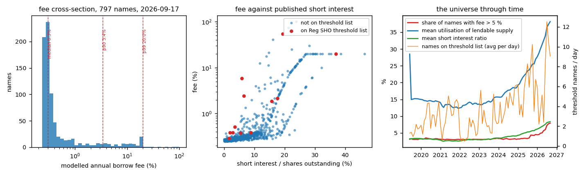
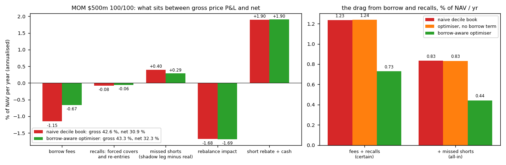
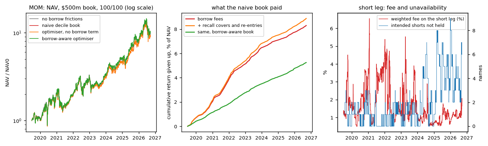
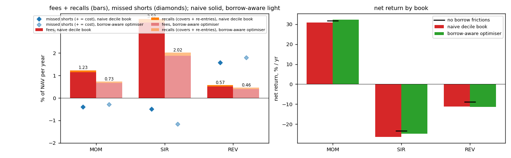
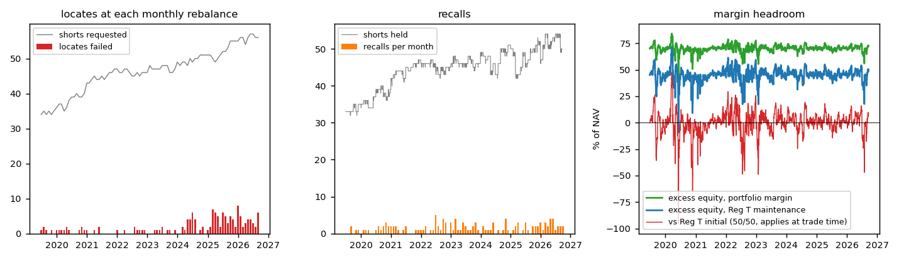
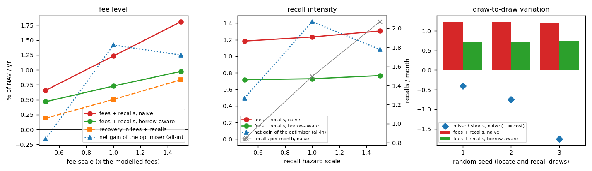
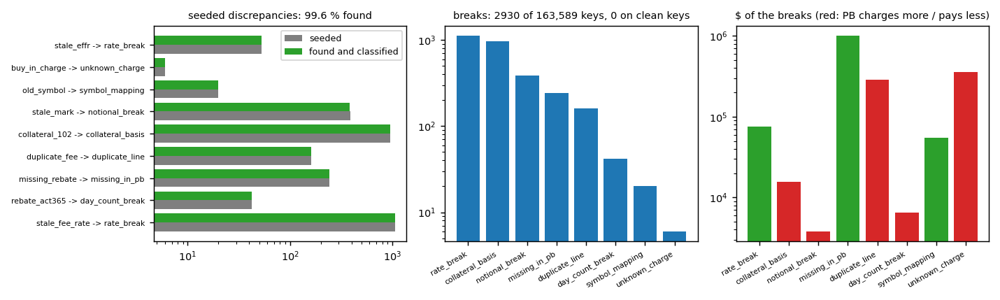

# securities-lending-analytics

Securities lending and financing analytics for a systematic long-short equity book: a borrow-cost database built from the free public record, a locate and recall simulation, a borrow-aware portfolio optimiser, and a financing layer with a prime-broker reconciliation. Everything is measured on a stated book: **$500m NAV, 100 % long / 100 % short, equal-weighted deciles of a 801-name US universe, rebalanced monthly from 2019-06-28 to 2026-08-31**.

**The one number.** On the 12-1 momentum book, borrow fees and recalls cost **1.23 % of NAV a year** (1.15 % in fees at a weighted fee of 1.37 % on the short leg, 0.08 % in forced covers and re-entries); 3.6 % of the shorts requested at a rebalance could not be located and 1.5 positions a month were recalled. The borrow-aware optimiser brings fees and recalls to **0.73 %** (weighted fee 0.92 %, locate failures 2.5 %): **a recovery of 0.51 % of NAV a year in fees and recalls**; net of the alpha it gives up to substitute cheaper names and of the squeeze term, the all-in gain is +1.42 % in this sample and not stable across draws (see Sensitivity). On the book that shorts the most-shorted decile the same numbers are 3.52 % and 2.02 %.

## Question and answer

*How much of a systematic long-short strategy's net return goes to borrow fees and recalls, how often does a short leg become unavailable, and how much does a borrow-aware optimiser recover?*

| | 12-1 momentum | short-interest | 1-month reversal |
|---|---|---|---|
| weighted fee on the short leg, naive → borrow-aware | 1.37 % → 0.92 % | 4.95 % → 2.59 % | 0.73 % → 0.57 % |
| fees + recalls, % of NAV a year | 1.23 % → 0.73 % | 3.52 % → 2.02 % | 0.57 % → 0.46 % |
| shorts that could not be located at the rebalance | 3.6 % → 2.5 % | 5.7 % → 2.7 % | 4.8 % → 4.2 % |
| recalls per 100 position-months | 3.4 → 2.7 | 6.7 → 4.8 | 2.5 → 2.4 |
| return the book missed on shorts it could not hold (+ = cost) | -0.40 % → -0.29 % | -0.49 % → -1.15 % | 1.58 % → 1.79 % |
| net return, naive → borrow-aware (no frictions) | 30.9 % → 32.3 % (31.8 %) | -26.5 % → -24.7 % (-23.3 %) | -11.1 % → -11.4 % (-8.9 %) |

Three things the numbers say. The fee bill is the certain part and it is large for any signal that shorts what everyone else is short: the momentum book's short leg costs 137 bp a year to borrow, the short-interest book's 495 bp. Recalls are frequent but cheap when a locate is available the next day (0.08 % a year in impact); their cost is the day out of the name. The shorts a desk cannot borrow are not random: over this sample the unlocatable names went up, so the momentum book was *helped* by 0.40 % a year by not holding them (concentrated in 2020 (-2.3 %), 2021 (-2.6 %), 2025 (-4.4 %); the sign flips in other years), which is the squeeze mechanism the literature describes (Engelberg, Reed and Ringgenberg 2018). It is also why the optimiser's all-in net gain (+1.42 % here) is not a stable number while its fee saving (0.51 %) is: the sensitivity section shows the all-in gain swinging between -0.16 % and +2.14 % as the substitutes' realised returns and the squeeze term change from book to book.

Absolute strategy returns are context, not the object of study: the universe is selected on the latest short-interest file, so it is heavily shorted by construction and survivorship-biased (see Data). The drag is measured on the positions the strategy actually holds, whatever their return.

## Layout

```
tools/download.py      FINRA short interest, Nasdaq and NYSE threshold lists, SEC fails to deliver, Yahoo prices and events,
                       Nasdaq shares outstanding, NY Fed EFFR; the universe from the latest FINRA file
slb/data.py            loaders, the point-in-time ticker map from the CUSIPs in the fails data, the DuckDB store
slb/borrow.py          the borrow model: daily observable panel -> specialness score -> fee, lendable supply, utilisation,
                       locate probability, recall hazard
slb/strategy.py        three monthly long-short signals, equal-weighted deciles
slb/optimiser.py       the borrow-aware optimiser (SLSQP, tracking-variance penalty against the naive book)
slb/backtest.py        the daily book simulation: locates, recalls and re-entries, fees, rebate, cash, impact, margin, the
                       shadow short leg, the drag decomposition
slb/financing.py       accruals ACT/360, Regulation T and portfolio margin, the PB statement with seeded discrepancies,
                       the reconciliation
slb/run.py, cli.py     the pipeline and the command line (python -m slb ...)
tests/                 35 tests on synthetic inputs: loaders, publication lags, splits, the fee map, the book identity,
                       locates and recalls, the optimiser, the reconciliation
scripts/               run_all.sh, plots.py, summarize.py, report.py, make_notebook.py
data/                  universe.csv, reference/ (shares outstanding, EFFR), derived/ (prices, events, the universe's slice of
                       short interest, threshold lists, fails, the ticker map); the raw files are rebuilt by tools/download.py
results/               run.json, the daily series, fin_breaks.csv, figures/, summary.md;  report.pdf;  notebooks/results.ipynb
.github/workflows/     ci.yml (tests + a short pipeline on the committed data); fetch-ib.yml (the IB shortable file, see Data)
```

## Data

| source | what | cadence and lag as used | rows |
|---|---|---|---|
| [FINRA equity short interest](https://www.finra.org/finra-data/browse-catalog/equity-short-interest/files) | shares short, average daily volume, days to cover, every listed security | settlement on the 15th and the last business day; published about nine business days later, and the model only sees it from then | 121,021 rows, 184 settlement dates |
| [Nasdaq](https://www.nasdaqtrader.com/Trader.aspx?id=RegSHOThreshold) and [NYSE](https://www.nyse.com/regulation/threshold-securities) Regulation SHO threshold lists | names with persistent fails to deliver (0.5 % of shares outstanding and 10,000 shares for five settlement days) | daily; used from the next morning, membership carried five business days. Nasdaq 1,937 daily lists, NYSE 1,937 (the NYSE endpoint answers 429 with a one-hour `Retry-After` after about 80 quick requests, so the downloader paces itself at one request every five seconds; a source covering under 80 % of the days is left out of the model until it is complete: both are complete and in the model) | 5,512 rows, 1,760 days |
| [SEC fails-to-deliver](https://www.sec.gov/data-research/sec-markets-data/fails-deliver-data) | CNS fails by settlement date, CUSIP and symbol | half-monthly files, posted about a month later | 609,820 rows |
| the CUSIPs in the fails data | the point-in-time ticker map: a CUSIP seen under two symbols links the old ticker to the new one (FB → META, SQ → XYZ, NYCB → FLG, ...), with the date the new symbol first appears | | 60 changes |
| [Yahoo Finance chart API](https://query2.finance.yahoo.com/v8/finance/chart/AAPL?range=10y&interval=1d&events=div,splits) | daily bars, dividends, splits, ten years | | 1,576,760 bars |
| [Nasdaq](https://api.nasdaq.com/api/quote/AAPL/summary?assetclass=stocks) | shares outstanding and market cap today (split-adjusted back in time with the Yahoo splits) | | 792 names |
| [NY Fed EFFR](https://markets.newyorkfed.org/api/rates/unsecured/effr/search.json?startDate=2015-01-01) | the effective federal funds rate for rebates and cash | daily | 2,941 days |
| [Interactive Brokers shortable file](ftp://ftp3.interactivebrokers.com/usa.txt) | fee rate, rebate rate and shares available, every US name, daily | **not reachable**: the FTP port is blocked on this network and the connection times out from GitHub's runners too ([fetch-ib.yml](.github/workflows/fetch-ib.yml) tries three hosts and three FTP modes once a week, commits the universe's slice when it succeeds and reports an unreachable server as a warning rather than a failure). `slb.borrow.fee_from_score` fits an isotonic map from the score to the IB fee as soon as 200 overlapping pairs exist; until then the fee comes from the published cross-section below | 0 |

The universe is the exchange-listed common stocks with the 600 largest short positions and the 600 largest average daily volumes in the latest FINRA file (801 names after the overlap; ETFs, trusts, preferreds and ADRs excluded), so it holds both the general-collateral names and the hard-to-borrow ones. Two consequences are stated up front: it is heavily shorted by construction (mean short interest ratio rises from 3.3 % in 2019 to 7.3 % in 2026 because the names were chosen for being shorted now), and it is survivorship-biased (a name that was heavily shorted in 2020 and later delisted is not in it, and Yahoo carries no history for delisted tickers). The raw downloads are 550 MB and are not committed; the universe's slice of each source is, under `data/derived/`, and `tools/download.py` rebuilds the rest.

## Method

### The borrow model

For each name and day the panel holds what a desk could have known that morning: the short interest ratio `SIR` (shares short over split-adjusted shares outstanding, from the FINRA file published nine business days after settlement; the *ratio* at settlement is what is carried forward, so a reverse split between the settlement and today does not leave a pre-split count over a post-split share count), days to cover `DTC`, threshold-list membership `T` (from the next morning, carried five business days), the fails-to-deliver ratio `FTD` (mean daily fails in the last published half-month over 20-day average volume, available a month after settlement), 20-day dollar volume `ADV` and the price `P`. The specialness score is a daily cross-sectional z-score composite (each `z` winsorised at ±3):

```
s = z(log(1 + 100·SIR)) + 0.5·z(log(1 + DTC)) + 1.5·T + 0.5·z(log(1 + FTD)) + 0.5·z(−log ADV) + 0.3·z(−log P)
```

The fee is the score's daily percentile rank pushed through the published cross-section of annual fees for US exchange-listed stocks, log-linear between the knots, with a floor set by utilisation:

```
F(q)  :  q = 0 → 0.25 %,  0.50 → 0.30 %,  0.75 → 0.40 %,  0.90 → 1 %,  0.95 → 2.5 %,  0.98 → 7 %,  0.99 → 15 %,  0.995 → 30 %,  1 → 100 %
L  = ℓ_cap · shares outstanding,   ℓ = 25 % (large, ≥ $10bn), 20 % (mid, ≥ $2bn), 12 % (small)         lendable supply
u  = shares short / L                                                                                 utilisation
φ(u):  u ≤ 0.7 → 0.25 %,  0.85 → 1.5 %,  1.0 → 5 %,  1.2 → 15 %,  1.5 → 40 %                          utilisation floor
fee = max(F(rank(s)), φ(u))
```

The knots of `F` are the general-collateral share (about 90 % of names below 1 %), the mean and the tail reported by D'Avolio (2002), Engelberg, Reed and Ringgenberg (2018) and Muravyev, Pearson and Pollet (2022); the floor is the shape Kolasinski, Reed and Ringgenberg (2013) document, fees insensitive to demand until the lendable supply is nearly exhausted. The floor binds on 1.5 % of name-days. The locate probability and the daily recall hazard follow from utilisation and the threshold flag:

```
p_locate = clip( π(u) · (1 − 0.5·T), 0.05, 1 ),   π(u) = 1 (u ≤ 0.5);  1 − 1.4(u − 0.5) (0.5 < u ≤ 1);  0.3 − 0.4·min(u − 1, 0.5) (u > 1)
h = h0 · (1 + h1 · min(u, 1.2)²) · (1 + h2 · T),   h0 = 7 bp / day,  h1 = 8,  h2 = 2
```

so a general-collateral name is recalled with probability about 1.5 % a month, a fully utilised one about 12 % a month and a threshold name three times that, in line with the recall frequencies in D'Avolio (2002) and the recall risk measures in Engelberg, Reed and Ringgenberg (2018). All of these are stated assumptions; the sensitivity section scales the fees and the hazards by ±50 % and more. When IB snapshots exist the map `F` is replaced by a pool-adjacent-violators (isotonic) regression of the IB fee on the score.

### The books and the simulation

Three signals on the candidate set of each month end (price ≥ $5, dollar volume ≥ $5m): 12-1 momentum (long the top decile of the return from 12 to 1 months ago, short the bottom), published short interest (long the least-shorted decile, short the most-shorted; Boehmer, Huszar and Jordan 2010), and one-month reversal. Deciles are equal-weighted, each leg 100 % of NAV, trades at the month-end close with 10 bp of impact per crossing. Every day:

1. **Mark to market** with adjusted-close returns on the unadjusted notional, so the short pays the dividend and the long receives it.
2. **Rebalance** (month end): every new short needs a locate, drawn with `p_locate`; a failed locate's weight goes pro rata to the shorts that were found, so the leg stays at 100 %. A shadow short leg holds every intended short regardless.
3. **Recalls**: every short is recalled with probability `h`; a recalled short is covered at the close (one crossing of impact) and re-entered the next day if a fresh locate succeeds (another crossing), or tried again each day until the next rebalance.
4. **Accruals** ACT/360: the fee on the short notional, the rebate at EFFR on the short proceeds, interest on the cash balance at EFFR + 50 bp when it is a debit and EFFR − 10 bp when it is a credit.
5. **Margin**: Regulation T initial (50 % of each leg), maintenance (25 % long, 30 % short, with FINRA 4210's per-share floors on cheap shorts), and portfolio margin (15 % of gross).

The decomposition, each term annualised as a share of the running NAV:

```
r_net = r_long + r_short − fees − recall impact − rebalance impact + rebate + cash interest
missed shorts (opportunity) = r_shadow_short − r_short             (> 0: the shorts the book could not hold would have made money)
drag from borrow and recalls = fees + recall impact  [+ missed shorts]
```

### The borrow-aware optimiser

On each rebalance date, with `x` the vector of long weights and short magnitudes over the candidate set (the top decile of longs; the bottom two deciles as short candidates so that there are substitutes), the optimiser solves

```
min_x   − Σ_i α_i w_i  +  λ Σ_i σ_i² (x_i − b_i)²  +  Σ_{i short} c_i x_i
s.t.    Σ_long x = 1,   Σ_short x = 1,   0 ≤ x_i ≤ max(4 %, 1.5/k)
α_i = (rank_i − ½) · spread                              expected monthly return from the signal rank, spread = 1 % a month
c_i = fee_i / 12 + (1 − (1 − h_i)^21) · 20 bp + (1 − p_locate,i) · |α_i|      expected monthly cost of holding the short
```

where `b` is the naive equal-weighted decile book, `σ_i` the 3-month realised volatility and `λ = 20`. The quadratic term is the tracking variance against the naive book, so a short's weight moves by about `−c_i / (2λσ_i²)` and the freed weight goes to the cheapest near-substitutes. The same problem with `c = 0` is the *risk-only* book, which differs from the naive book only through the alpha ramp (active share 1.2 %); the difference between the risk-only and the borrow-aware book therefore isolates the borrow term. SLSQP on a few hundred variables takes well under a second; `spread`, `λ` and the sensitivity to both are reported.

### The financing layer and the reconciliation

`slb.financing` writes one accrual line per (date, symbol, kind) from the book's own positions and builds the prime broker's version of the same statement with nine kinds of seeded discrepancy: a stale fee rate for a symbol-month, ACT/365 on a symbol's rebate for a quarter, missing rebate lines, duplicated fee lines, fees accrued on 102 % cash collateral for a month (a convention, not an error, but one that has to be explained), a stale mark, the old ticker for the first days after a rename, buy-in charges the book does not have, and yesterday's EFFR on the day the rate changes. The reconciliation joins on (date, symbol, kind), maps renamed tickers through the point-in-time symbol history, and compares the contract terms exactly (line count, rate, notional basis, day count) before the residual dollar amount against a $0.50 tolerance, because a wrong term on a general-collateral name is a few cents a day and systematic; it classifies each break and is scored against the seeds it never sees.

## Results



The modelled fee cross-section on 2026-09-17: 85 % of names below 1 % (the published figure is 85-92 %), mean 1.89 %, p90 3.42 %, p99 20.00 %, 12 names on a threshold list; names on a threshold list carry a mean fee of 7.42 % against 1.15 % off it. A check on whether the ordering carries information: sorted by modelled fee at each month end, general-collateral names returned 0.97 % a month over the next month and names above 5 % returned 1.48 % (difference -0.51 %, t = -0.5). That is the opposite sign to the literature's (expensive-to-short stocks underperform: Jones and Lamont 2002; Drechsler and Drechsler 2016) and not significant: in this short-heavy, survivorship-biased universe the expensive names are the ones that squeezed in 2020-21 and 2025, which is also why the missed-shorts term below is negative. The ordering is checked here, not the premium; it would take the IB fees and a survivorship-free universe to test the latter.





| 12-1 momentum, $500m, 100/100 | gross price P&L | missed shorts | borrow fees | recalls | rebalance impact | rebate + cash | net (log) | vol | fee on short leg | locate failures | recalls / 100 position-months |
|---|---|---|---|---|---|---|---|---|---|---|---|
| no lending frictions | 42.3 % | 0.00 % | 0.00 % | 0.00 % | 1.69 % | 1.91 % | 31.8 % | 46 % | 0.00 % | 0.0 % | 0.0 |
| naive | 42.6 % | -0.40 % | 1.15 % | 0.08 % | 1.68 % | 1.90 % | 30.9 % | 46 % | 1.37 % | 3.6 % | 3.4 |
| optimiser, no borrow term | 42.6 % | -0.41 % | 1.16 % | 0.08 % | 1.67 % | 1.90 % | 31.0 % | 46 % | 1.38 % | 3.6 % | 3.4 |
| borrow-aware optimiser | 43.3 % | -0.29 % | 0.67 % | 0.06 % | 1.69 % | 1.90 % | 32.3 % | 46 % | 0.92 % | 2.5 % | 2.7 |





Unavailability is not uniform: 3.6 % of requested shorts failed their locate over the sample, but the rate runs from 2.5 % in 2019 to 6.5 % in 2026 as the universe's utilisation rises, and the failures concentrate in a few names (KSS 15, UPST 10, SPRY 7, NVAX 6, ARRY 5, ENVX 5 failed locates). The margin headroom of a 100/100 book is exactly zero against Regulation T's 50/50 initial requirement at the rebalance and 72 % of NAV under portfolio margin on the last day; Reg T maintenance was breached on one day (8 June 2020, a day the short leg rallied hard; excess equity -9 % of NAV), portfolio margin never.



| fee scale | hazard scale | fees + recalls, naive | borrow-aware | recovery | net gain of the optimiser |
|---|---|---|---|---|---|
| 0.5 | 1.0 | 0.66 % | 0.47 % | 0.19 % | -0.16 % |
| 1.0 | 1.0 | 1.23 % | 0.73 % | 0.50 % | +1.42 % |
| 1.5 | 1.0 | 1.81 % | 0.98 % | 0.83 % | +1.25 % |
| 1.0 | 0.5 | 1.18 % | 0.72 % | 0.47 % | +0.49 % |
| 1.0 | 1.5 | 1.31 % | 0.77 % | 0.54 % | +1.08 % |
| 1.5 | 1.5 | 1.91 % | 1.04 % | 0.87 % | +1.10 % |
| 2.0 | 2.0 | 2.32 % | 1.30 % | 1.02 % | +2.14 % |

The recovery in fees and recalls grows with the fee level (the optimiser has more to save) and is insensitive to the recall intensity (recalls are cheap when re-entry is possible). The all-in net gain is not a stable number: it runs from -0.16 % to +2.14 % across the grid, because the substitutes' realised returns and the squeeze term change from book to book by more than the fee saving. Across random seeds the naive fees + recalls move by 1.21 % to 1.23 % and the missed-shorts term by -1.76 % to -0.40 %: the fee bill is a stable number, the squeeze term is not. With the optimiser's alpha assumption halved (0.5 % a month) or doubled (2 %) the fee-and-recall saving is 0.49 % and 0.50 %; with the tracking penalty λ at 5 or 80 it is 0.70 % and 0.26 %. The names that leave the book are the ones whose fee exceeds any plausible alpha, so the saving depends little on the alpha assumption and mostly on how far the optimiser is allowed to move.



On the naive momentum book the short rebate earns 1.91 % of NAV a year, the fees cost 1.15 % and the cash balance -0.01 % (net financing 0.75 %) over 163,563 accrual lines. The prime-broker statement (163,488 lines) reconciles to 2,930 breaks on 163,589 keys with 0 false positives; 99.6 % of the seeded discrepancies are found and classified as the right type, the remainder being differences below the $0.50 tolerance on the residual amount.

| seeded discrepancy | expected break type | seeded | found as expected |
|---|---|---|---|
| stale_fee_rate | rate_break | 1069 | 1061 |
| rebate_act365 | day_count_break | 42 | 42 |
| missing_rebate | missing_in_pb | 242 | 242 |
| duplicate_fee | duplicate_line | 161 | 161 |
| collateral_102 | collateral_basis | 957 | 957 |
| stale_mark | notional_break | 388 | 385 |
| old_symbol | symbol_mapping | 20 | 20 |
| buy_in_charge | unknown_charge | 6 | 6 |
| stale_effr | rate_break | 53 | 53 |

## Validation

- **35 tests** (`python -m pytest -q`) on synthetic inputs: the loaders and the placeholder-ticker filter, the point-in-time relabelling (CCC was Clarivate until 2021 and CCC Intelligent Solutions from 2025: the rows are mapped by date, not by symbol), the settlement-date rule (15th and month end moved to the preceding business day; 15 January 2024 is MLK day, 29 March 2024 is Good Friday), the publication lag (a short-interest print is invisible until nine business days after settlement), the next-morning threshold flag with five-day persistence, the fails lag, split-adjusted shares outstanding and the reverse-split-after-settlement case, the fee map at its knots, pool-adjacent-violators against a hand solution, the utilisation floor, the book's P&L identity to 1e-12, fee and rebate accruals, dividends paid by the short, locate failure and the shadow leg, recall and re-entry, Reg T and portfolio-margin numbers, the optimiser reproducing the naive book without costs and dropping a 60 %-fee name with the leg still summing to −1, a clean PB statement reconciling with zero breaks, and every seeded discrepancy type found with zero false positives.
- **The fee cross-section** against the literature (share GC, mean, tail) and the forward-return sort above; **threshold names** carry higher fees; the **IB path** is tested on a synthetic file (isotonic fit, Spearman > 0.99) so that it works the day the workflow delivers a snapshot.
- **CI** runs the tests, rebuilds the store and the borrow table from the committed derived data and runs the 2024-on pipeline.

## Traps in the data

- **Reverse splits after the settlement date.** The names with the largest short interest are the ones that reverse-split. FINRA's count is in pre-split shares, today's shares outstanding is post-split, and a naive ratio gives short interest of 1,200 % (GOSS, NFE, OPTT in September 2026). The ratio at settlement is what carries forward.
- **Placeholder tickers in the CNS files.** `ANETZZZZ`, `BMNRD`: temporary symbols around corporate actions share a CUSIP with the real ticker and would otherwise look like renames; they are filtered by pattern.
- **Ticker reuse.** A rename map keyed on symbol alone moves the 2025 CCC's short interest to Clarivate. Every relabel is conditioned on the date.
- **The NYSE threshold API** answers 429 with a one-hour `Retry-After` after about 80 requests, however they are paced; the downloader waits it out, so the full history takes a day to collect and the model leaves the source out until its coverage is complete. FINRA's `.txt` files return 403, the `.csv` versions do not. The SEC needs a contact-style `User-Agent`. Yahoo needs `BRK-B` where FINRA says `BRKB` (three such names have no price history and drop out).
- **Fee tolerance in a reconciliation.** A dollar tolerance on the amount hides a wrong day count or a 2 % collateral basis on a general-collateral name (a few cents a day, every day). Terms are compared exactly and the tolerance applies to the residual only.
- **Two books can have the same "recalls per month" and different recall rates**: the optimiser holds more names, so recalls are reported per 100 position-months as well.

## Reproducing

```
python tools/download.py all --from 2019-01-01      # FINRA, threshold lists, SEC fails, Yahoo, Nasdaq, NY Fed (about an hour; the NYSE list is slow)
python -m slb build-store && python -m slb borrow   # or straight from the committed data/derived
python -m slb run                                   # results/run.json and the daily series (about 10 minutes)
python scripts/plots.py && python scripts/summarize.py && python scripts/report.py
```

`scripts/run_all.sh --skip-download` does all of it on the committed data; `python -m slb run --quick --reuse` is the CI variant.

## References

- D'Avolio, G. (2002). The market for borrowing stock. *Journal of Financial Economics* 66(2-3), 271-306. [doi:10.1016/S0304-405X(02)00206-4](https://doi.org/10.1016/S0304-405X(02)00206-4)
- Engelberg, J. E., Reed, A. V., Ringgenberg, M. C. (2018). Short-selling risk. *Journal of Finance* 73(2), 755-786. [doi:10.1111/jofi.12601](https://doi.org/10.1111/jofi.12601)
- Kolasinski, A. C., Reed, A. V., Ringgenberg, M. C. (2013). A multiple lender approach to understanding supply and search in the equity lending market. *Journal of Finance* 68(2), 559-595. [doi:10.1111/jofi.12007](https://doi.org/10.1111/jofi.12007)
- Muravyev, D., Pearson, N. D., Pollet, J. M. (2022). Is there a risk premium in the stock lending market? Evidence from equity options. *Journal of Finance* 77(3), 1787-1828. [doi:10.1111/jofi.13123](https://doi.org/10.1111/jofi.13123)
- Boehmer, E., Huszar, Z. R., Jordan, B. D. (2010). The good news in short interest. *Journal of Financial Economics* 96(1), 80-97. [doi:10.1016/j.jfineco.2009.12.002](https://doi.org/10.1016/j.jfineco.2009.12.002)
- Jones, C. M., Lamont, O. A. (2002). Short-sale constraints and stock returns. *Journal of Financial Economics* 66(2-3), 207-239. [doi:10.1016/S0304-405X(02)00224-6](https://doi.org/10.1016/S0304-405X(02)00224-6)
- Drechsler, I., Drechsler, Q. F. (2016). The shorting premium and asset pricing anomalies. NBER Working Paper 20282. [nber.org/papers/w20282](https://www.nber.org/papers/w20282)
- Cohen, L., Diether, K. B., Malloy, C. J. (2007). Supply and demand shifts in the shorting market. *Journal of Finance* 62(5), 2061-2096. [doi:10.1111/j.1540-6261.2007.01269.x](https://doi.org/10.1111/j.1540-6261.2007.01269.x)
- Beneish, M. D., Lee, C. M. C., Nichols, D. C. (2015). In short supply: Short-sellers and stock returns. *Journal of Accounting and Economics* 60(2-3), 33-57. [doi:10.1016/j.jacceco.2015.08.001](https://doi.org/10.1016/j.jacceco.2015.08.001)
- Jegadeesh, N., Titman, S. (1993). Returns to buying winners and selling losers. *Journal of Finance* 48(1), 65-91. [doi:10.1111/j.1540-6261.1993.tb04702.x](https://doi.org/10.1111/j.1540-6261.1993.tb04702.x)
- SEC, [Regulation SHO](https://www.sec.gov/investor/pubs/regsho.htm) (threshold securities, Rule 203); Federal Reserve [Regulation T](https://www.ecfr.gov/current/title-12/chapter-II/subchapter-A/part-220) (12 CFR 220); [FINRA Rule 4210](https://www.finra.org/rules-guidance/rulebooks/finra-rules/4210) (maintenance margin, the per-share floors on short positions).
